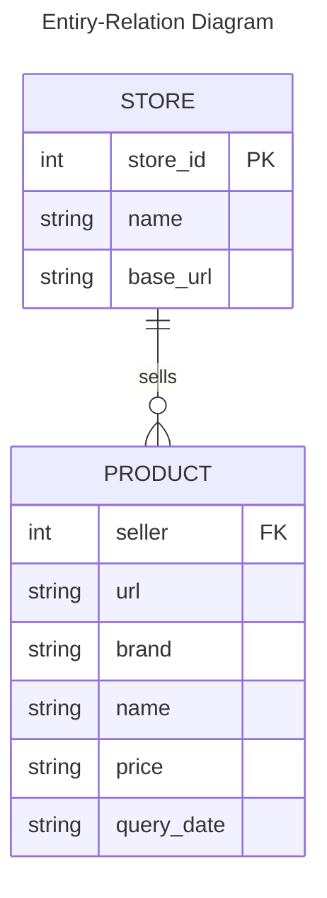
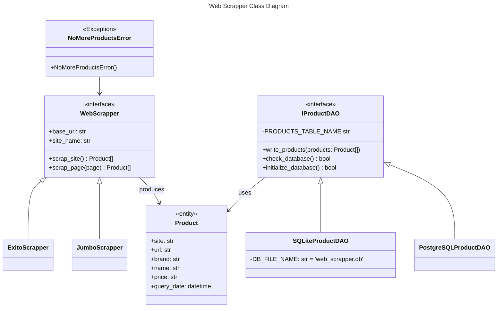

# Grocery Shopping Web Scrapper

Web Scrapper for some popular colombian grocery stores.

# Requirements

Depends on:

- Python>=3.7
- Selenium>=4.9

# Usage

To use this web scrapper you need:

1.  Install python requirements

        pip install -r requirements.txt

2.  run the scrapper

        python3 web_scrapper.py

At this point, the scrapper will be running and a Chrome web browser will open. Don't touch it while the program is running, it will close when the scrapping is done.

When the process is finished, it will flush the scrapped results to the configured database (SQLite by default) to a table named "products".

# Entity-Relation Diagram

# Class Diagram

