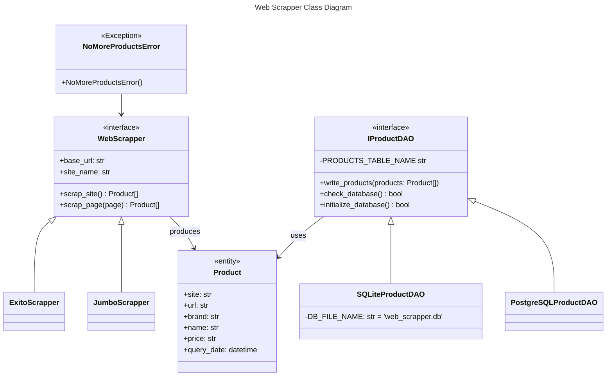

# Grocery Shopping Web Scrapper

# Class Diagram

```mermaid
---
title: Web Scrapper Class Diagram
---
classDiagram

    class WebScrapper {
        +base_url: str
        +site_name: str
        +scrap_site() Product[]
        +scrap_page(page) Product[]
    }

    <<interface>> WebScrapper 

    class ExitoScrapper
    class JumboScrapper

    class Product{
        <<entity>>
        +site: str
        +url: str
        +brand: str
        +name: str
        +price: str
        +query_date: datetime
    }
    class IProductDAO{
        <<interface>>
        -PRODUCTS_TABLE_NAME str
        +write_products(products: Product[])
        +check_database() bool
        +initialize_database() bool
    }
    

    class SQLiteProductDAO {
        -DB_FILE_NAME: str = 'web_scrapper.db'
        
    }
    class PostgreSQLProductDAO

     class NoMoreProductsError{
        <<Exception>>
        +NoMoreProductsError()
    }

    NoMoreProductsError --> WebScrapper

    WebScrapper <|-- ExitoScrapper
    WebScrapper <|-- JumboScrapper

    WebScrapper --> Product : produces
    IProductDAO --> Product : uses

    IProductDAO <|-- SQLiteProductDAO
    IProductDAO <|-- PostgreSQLProductDAO


```

